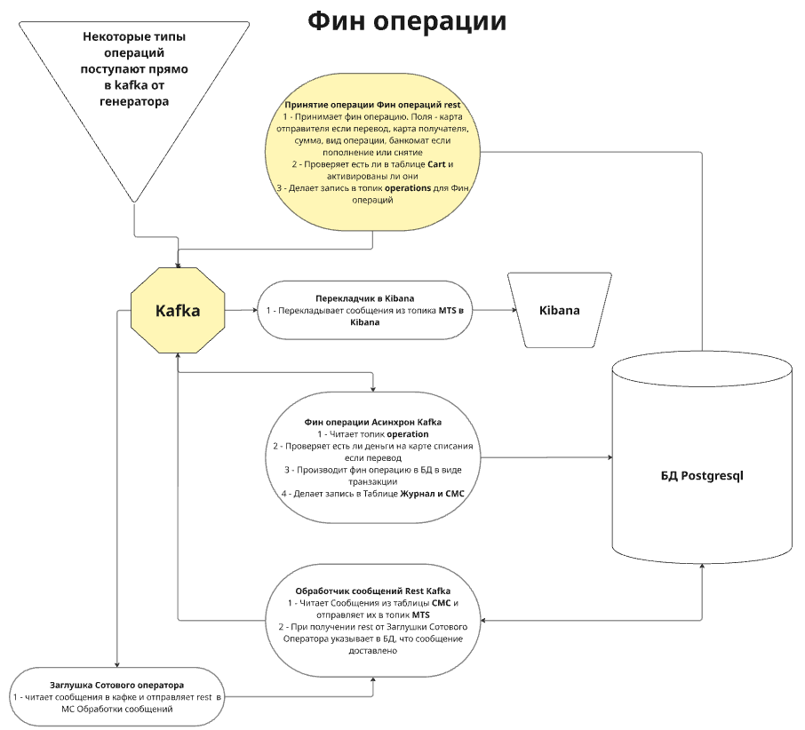
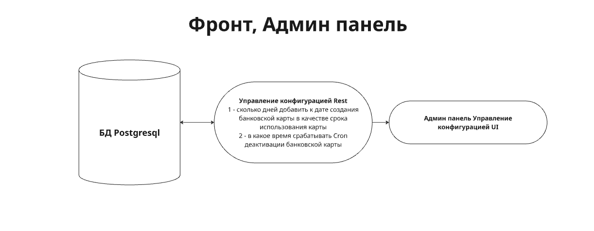
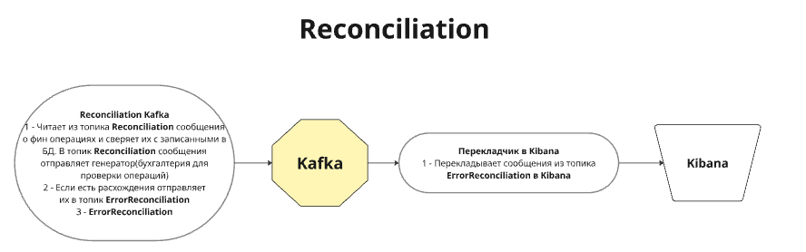
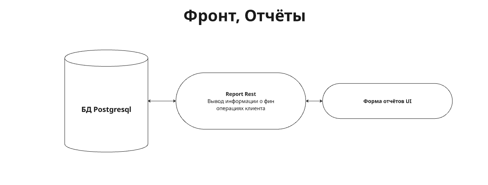
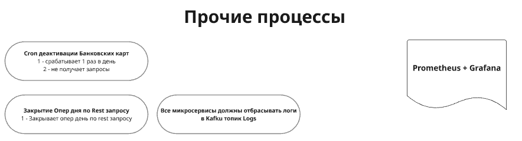

# **bank-Z**
## 

## __В данный момент реалиpовывается уровень зрелости №1.__

## Этот проект демонстрирует навыки:
- работать с современными компонентами, популярными в крупных высоконагруженных системах;
- программирования на Java;
- написания скрптов на bash, plsql, SQL;
- создания скриптов для нагрузочного тестирования (JMeter, LoadRunner, K6, Gatling);
- подготовки мониторинга системы и средств НТ;
- проведения различных нагрузочных тестов и анализ их результатов;
- подготовки Методики нагрузочного тестирования и Оформление отчётов НТ.

## В проекте используются:
- docker, kubernetes
- микросервисы на java, spring
- postgresql
- kafka
- ELK
- Kibana
- prometheus
- influxdb
- grafana и т.д.

## В проекте используются протоколы передачи данных:
- HTTP
- TCP/IP

## За основу взяты операции с банковскими картами:
- создание клиента
- создание карты и привязки её к клиенту
- деактивация карты
- пополнение карты денежными средствами
- снятие денежных средств с карты
- перевод денежных средств с одной карты на другую
- проверка поступающей информации от смежных систем с проведенными транзакциями
- формирование отчётов по клиентам (движение денежных средств и наличие карт)
- админ панель для управления настройками и данными (валюта, список банкоматов и филиалов, тип операций и т.д.)
- т.д.

## Инструменты НТ, с которых подаётся нагрузка:
- JMeter
- LoadRunner
- K6
- Gatling

## Уровни зрелости проекта:
1) реализованы операции: создание клиента и карточки, нет UI, есть возможность проводить тесты одним из инструментов НТ, реализован мониторинг всех компонентов, вся система (включая заглушки), кроме генераторов нагрузки, разворачивается в docker.
2) к уже реализованным добавлены основные фин. операции: пополнение, снятие, перевод денежных средств, нет UI, есть возможность проводить тесты тремя инструментами НТ (JMeter, LoadRunner, K6).
3) к уже реализованным сервисам добавлен UI, добавлены дополнительные средства мониторинга и отладки (профилировщики, мониторинг блокировок postgres, снятие awr и т.д.).
4) реализованы все сервисы и выполняются все операции (отчёты, проверки и т.д.).
5) реализовано автоматическое разворачивание всей системы без написания какого-либо кода, команд или настроек; автоматизирована генерация данных, проверка готовности стенда перед запуском НТ, есть возможность проводить НТ на Gatling.
6) реализована Методика Нагрузочного тестирования, сформирован отчёт о проведённых тестах, подготовлены инструкции по разворачиванию системы.

_P.S. Хорошо бы разнообразить используемые протоколы передачи данных, добавить авторизацию (jwt токен). Добавить redis, klickhous ..._

## Схемы и зображения

