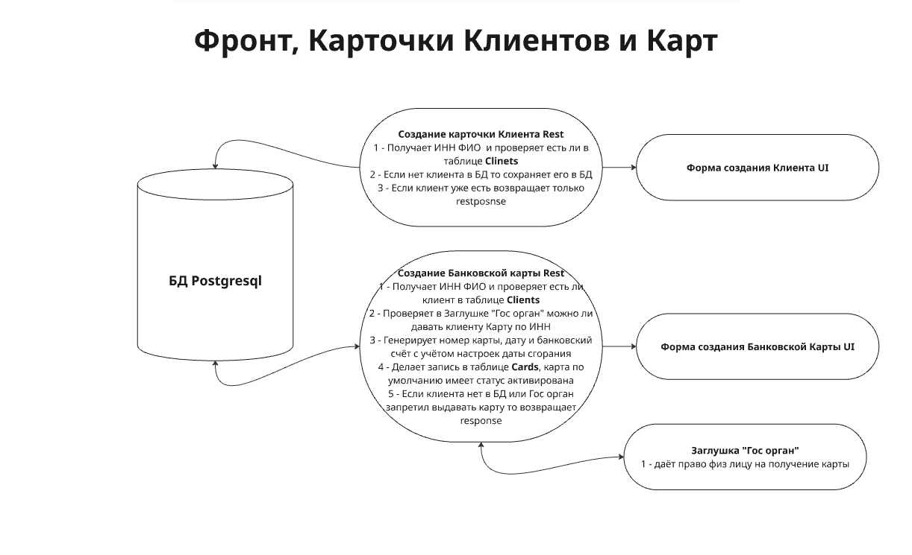
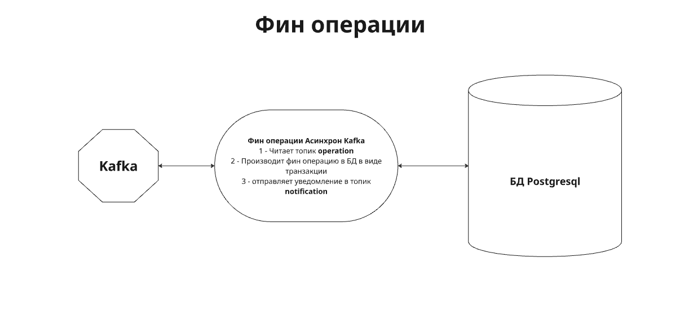
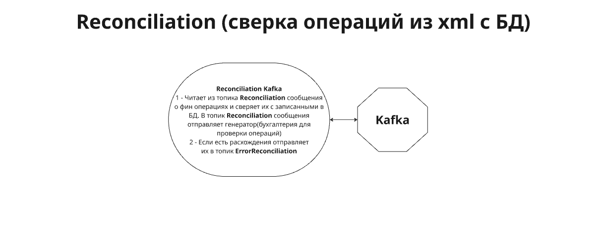

# **bank-Z**

## Настоящий проект демонстрирует владение следующими навыками:
- Работа с современными компонентами, широко применяемыми в высоконагруженных промышленных системах.
- Программирование на языке Java и Python.
- Разработка скриптов на языках bash, PL/SQL и SQL.
- Создание скриптов и сценариев для проведения нагрузочного тестирования с использованием инструментов JMeter, LoadRunner, K6 и Gatling.
- Настройка и конфигурирование систем мониторинга и средств наблюдения за производительностью.
- Настройка и использование дополнительных средст анализа: профилировщиков, awr и пр.
- Проведение различных видов нагрузочных тестов и анализ полученных данных.
- Разработка методик проведения нагрузочного тестирования и подготовка формализованных отчетов по результатам испытаний.

## В данный момент реалиpовывается уровень зрелости № 2

## Уже реализованы:
  - развёрнуты основные компоненты системы: 
	 - docker 
	 - postgresql
	 - kafka
	 - ELK
	 - Jenkins
	 - Prometheus
	 - InfluxDB
	 - Grafana
  - реализованы операции:
	 - создание клиента(без UI)
	 - создание карты(без UI)
	 - авторизация и регистрация с UI
	 - операции пополнения и снятия средств с карты
	 - заглушки
  - есть возможность проводить тесты с помощью Jmeter
  - реализованы средства мониторинга
  - вся система включая заглушки и генераторы нагрузки разворачивается в docker.

## В проекте используются:
- docker
- микросервисы на java 17, spring, python
- postgresql
- kafka
- ELK
- Kibana
- prometheus
- influxdb
- grafana
- ansimble и т.д.

## В проекте используются протоколы передачи данных:
- HTTP
- TCP/IP
- JWT
- JDBC

## За основу взяты некоторые банковские операции:
- создание клиента(rest)
- создание карты и привязки её к клиенту (rest)
- пополнение карты денежными средствами (асинхронная операция)
- снятие денежных средств с карты (асинхронная операция)
- проверка поступающей информации от смежных систем с проведенными транзакциями (обработка больших xml файлов)
- формирование отчётов по движению денежных средств (rest)
- авторизация и регистрация (rest)
- админ панель для управления настройками и данными (валюта, список банкоматов и филиалов, тип операций и т.д.) (rest)
- дополнительнно, сервис имеющий запланированную утечку и проблемы с производительностью(нет бизнес логики, только для обучения) (rest)

## Инструменты НТ используемые для подачи нагрузки:
- JMeter
- LoadRunner
- K6
- Gatling

## Инструменты мониторинга:
- Prometheus
- Influxdb
- Grafana

## Дополнительноые инструменты анализа:
- Visualvm
- MemoryAnalyzer
- ELK

## Дополнительноые инструменты автоматизации:
- Jenkins
- Ansible
- Bash
- PLSQL

## Используемые языки:
- Java, Spring
- Python
- Java-Script

## Уровни зрелости проекта:
1) - развёрнуты основные компоненты системы: 
	 - docker 
	 - postgresql
	 - kafka;
   - реализованы операции:
	 - создание клиента(без UI)
	 - создание карты(без UI)
	 - авторизация и регистрация с UI
	 - операции пополнения и снятия средств с карты
	 - заглушки;
   - есть возможность проводить тесты с помощью Jmeter;
   - реализованы средства мониторинга;
   - вся система включая заглушки и генераторы нагрузки разворачивается в docker.
## 
2) - настроен полноценный мониторинг всех компонентов;
   - добавлены дополнительные средства мониторинга и отладки:
     - профилировщики
	 - мониторинг блокировок postgres
	 - снятие awr;
   - реализованна возможность проводить тесты тремя инструментами НТ(JMeter, LoadRunner, K6), скрипты и сценарии полностью готовы и отлажены.
## 
3) - к уже реализованным сервисам добавлен:
     - UI там где необходим
     - обработка больших xml файлов
	 - формирование отчётов с UI
	 - ai-агент(чат для помощи клиентам)
	 - админ панель с UI
	 - сервис имеющий запланированную утечку и проблемы с производительностью(нет бизнес логики, только для обучения).
## 	 
4) - настроен ELK для логов;
   - добавлены кастомные бизнесовые метрики;
   - устранены функциональные дефекты и прочие недочёты системы;
   - автоматизирована: 
     - генерация данных
	 - сохранение скриншетов из grafana
	 - проверка готовности компонентов к НТ
	 - запуск НТ.
## 
5) - реализовано автоматическое разворачивание всей системы с минимальной ручной работой;
   - есть возможность проводить НТ на Gatling;
   - скрипты и сценарии для всех инструментов НТ актуализированы и отлажены.
## 
6) - реализована Методика Нагрузочного тестирования;
   - проведено НТ с помощью всех четырёх инструментов;
   - сформирован отчёт о проведённых тестах;
   - в wiki github подготовлены инструкции по разворачиванию и работе системы.

## 

## Для визуальной организации задач и рабочего процесса используется Projects в github - https://github.com/users/AzamatLT/projects/1

## Документация ведётся тут - https://github.com/AzamatLT/bank-Z/wiki/Welcome

## Схемы и зображения

